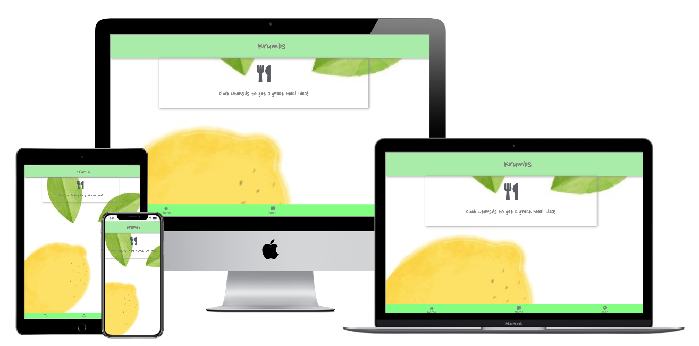
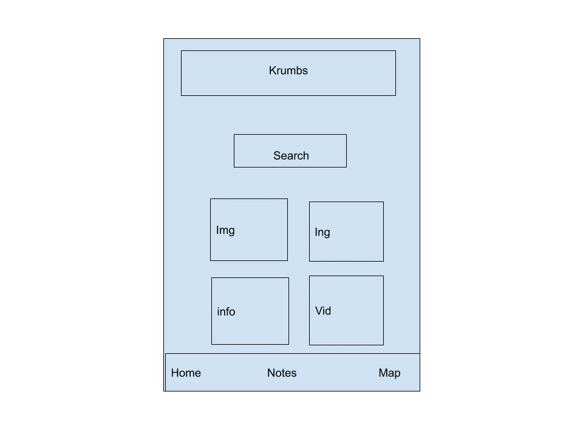
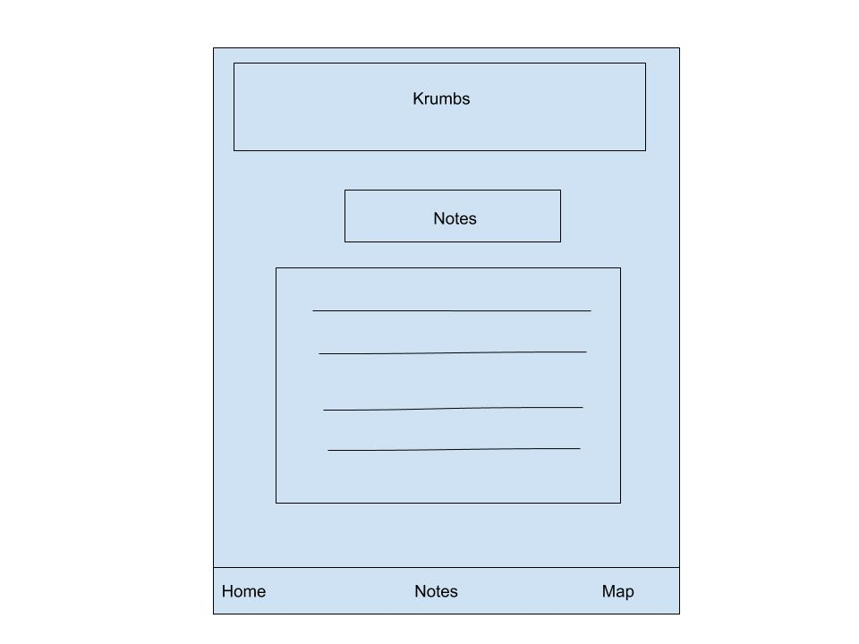
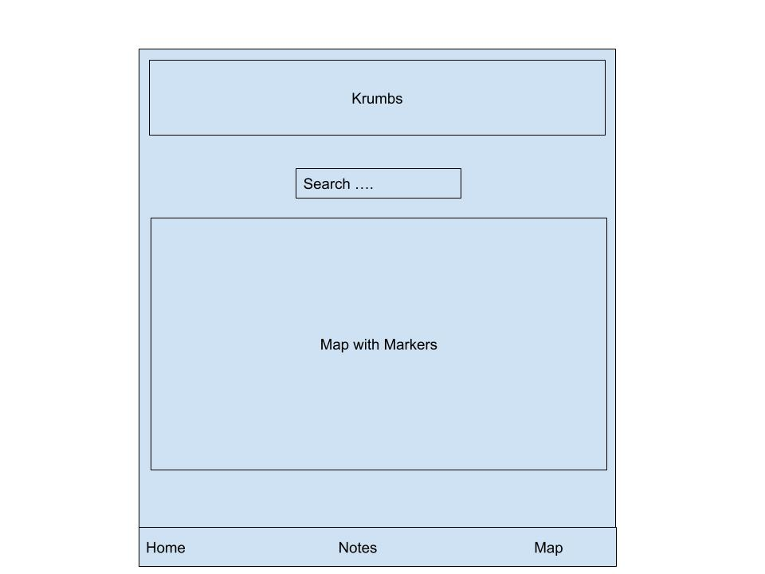

# Krumbs

This is my food for thought website created to display my use of HTML, CSS, JS & API's to potential employers and clients. It is created with the idea of producing a viable product for users to find an attractive meal for there next breakfast/lunch/diner. It will pull a random meal idea from an API and present it to the user. If the user likes what they see they have the ability to record need items in the notes page and find the nearest grocery store to their location in the maps section. All done in a responsive format.

 

## UX
 
My Objective in this design was to create a simple usable website first. Make it easy for potential users to remain enganged and find use of the app interesting. It is geared to people interested in food and/or cooking, and whating to try something new. With this in mind the idea was to continue to make the website as convenient and adding futher help by being able to recording outstanding ingredients for the different meals that are still needed and to find the nearest grocery store to them if they are away from home at the time.

###  User Stories

- Owner
I wanted to create a fun and engaging food website that would keep users curious and thirsting for new culinary experiences. To do this i wanted an instant gratification without effort to be achieved with a find me a random meal button that will give the user an instant answer with each click with a variety of options poping up. When the user finds something interesting they are to be given the ability to write the ingredients they still need and nearest location to find needed ingredients.

- User
-I dont what to over think hence the reason i am using a website/application which will give me an idea of what type of breakfast/lunch/ and/or diner i would like to eat. 
-I would like to be able to store ingredients in a list that is handy eg on my phone if i am coming back from work and cant get to a pen or paper. 
-Additionally if i am out of my own town holidays or business i would like to find nearest grocery shop with out having to open up another website or applicaiton todo so.
 
## Wireframes

- I created mock ups for my website before commencement of coding the project and are attached.
-[wireframes](https://github.com/Wonka86/Krumbs/tree/master/assets/wireframes)

Landing

 

Notes

 

Map

 

## Features

The following section outlines implemented features and future features to be implemented
 
### Existing Features

- Fully Responsive website achieving the ability for users to get the information the require from mobile, touch pad ot computer.
- One click random button function which fetches information on a random meal to be supplied to a user. Giving informaiton on Type of meal, ingredients needed, instructions on cooking , picutre of meal and video instructions on how to make meal. Using TheMealDB api.
- Note pad page allowing for the user to save a meal and a secondary list for each meal with the ingredients needed. This note pad has the ability to retain information when exited and can be retrieved by returning to the website if exited
- Maps page that allows user to specifically search for nearest grocery stores to a certain location and puts markers up - using google maps api.

### Features Left to Implement
- Comments page for user feed back on meals they have come across they gave particular enjoyment or meals they would recommend not trying.
- specific search page if user has a favourite meal they would like to revisit again.

## Technologies Used

In this section i introduce the technologies i have used to build the Gym website.

- [HTML5](https://en.wikipedia.org/wiki/HTML5) - markup language for the structure and presentation of World Wide Web contents.
- [CSS](https://en.wikipedia.org/wiki/Cascading_Style_Sheets) - used to format the layout of Web pages.
- [JavaScript](https://en.wikipedia.org/wiki/JavaScript) - used to fetch the information from api.
- [Font Awesome](https://fontawesome.com/) - Toolkit used to style website with icons.
- [Google Fonts](https://fonts.google.com/) - a font and icon toolkit.

## Testing

For this project I checked to ensure the website would work with 3 popular web browsers Chrome, Firefox and Edge (although this will be deprecated) To check the website is responsive and sizes correctly deepening on the size of the browser window.

- Website navigation and functionality
 1. Try to click on each button in the navigation menu and that each button links to the relevant section (Home/ Notes/ Map).
 2. Clicked on the Utensiles random meal button make sure getting a random meal each time.
 3. Tried repated meals and secondary ingredients lists by adding new meals and ingredients to each removing them individually and clearing them from the web page. By exiting the webpage and returning to notes pad to make sure they where still there when added and making sure they where deleted when returning after deletion.
 4. Visiting the maps page and searching for grocery stores in the search bar. Google markers popped up in the location with grocerys stores in the area.
 
 - Interesting bugs or problems you discovered during your testing.
  - Sometimes the TheMealDB api returns no video instruction for the meal.

During the testing of the website i also used the following Tools:

- [Chrome dev Tools](https://developers.google.com/web/tools/chrome-devtools)
- [css validation](https://jigsaw.w3.org/css-validator/)
- [JS validation](https://codebeautify.org/jsvalidate)
- [HTML validation](https://validator.w3.org/)

## Deployment

This site is hosted using GitHub pages, deployed directly from the master branch. The deployed site will update automatically upon new commits to the master branch.

### GitHub Pages
This project was deployed to a hosting platform via GitHub Pages from the master branch.
To achieve this the following steps were taken:
Go to the repository on GitHub: 
Go to Settings.
GitHub Pages.
Select the master branch.
The website being deployed and can be found at:https://wonka86.github.io/Krumbs/
### Local
To run locally, you can clone this repository directly into the editor of your choice by pasting git clone 'https://github.com/Wonka86/Krumbs' into your terminal. To cut ties with this GitHub repository, type git remote rm origin into the terminal.
## Credits

### Content
- All text in this project is written by myself
- Information for the meals comes from [TheMealDB.com](https://www.themealdb.com/api.php) api
- Map information comes from the google maps api and libraries

### Media
- Backgroungd images used in this site were obtained from [Pexels](https://www.pexels.com/) and [Goggle Images](https://www.google.co.uk/imghp?hl=en&tab=wi&ogbl)
### Acknowledgements

- I received inspiration for this project from my wifes healthy living and a big thanks goes to code institute tutors for their patience and my mentor victor for input on tidying up my ui.
